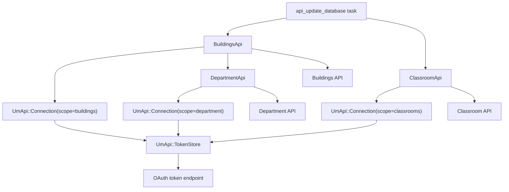
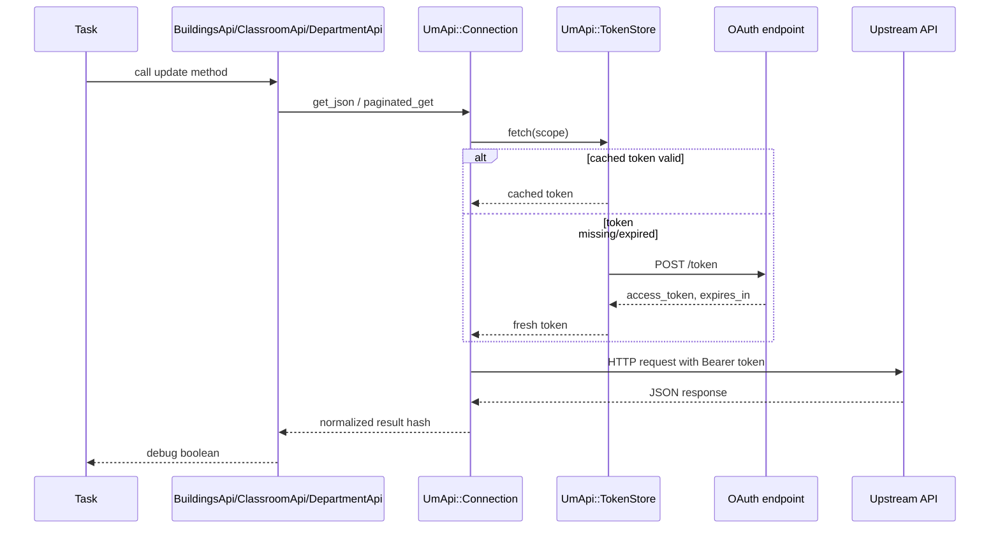
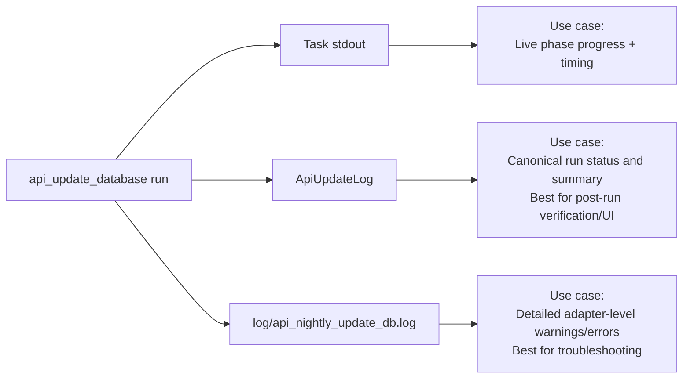
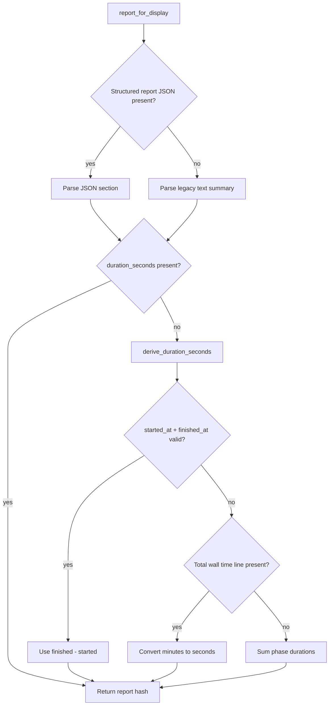

# API Update Flow

This document explains how the `api_update_database` task works after the API refactor, what changed, and how to validate the flow in staging.

## Main Entry Points
- `lib/tasks/api_update_database.rake`
- `lib/um_api.rb`
- `lib/auth_token_api.rb`
- `lib/buildings_api.rb`
- `lib/classroom_api.rb`
- `lib/department_api.rb`
- `config/environment.rb`

## High-Level Architecture



## Why The Refactor Exists

Before the refactor, each API class built its own `Net::HTTP` requests, repeated header setup, and handled tokens independently. The refactor moved shared behavior into `UmApi` so that:

- OAuth tokens are cached per scope inside a single process.
- HTTP request setup is centralized.
- pagination behavior is centralized.
- error normalization is centralized.
- department lookups can be bulk-preloaded during room sync.

The application still keeps separate domain adapters for buildings, classrooms, and departments so the update logic remains readable and the task still calls the same high-level methods.

## Core Components

### `UmApi::TokenStore`

`UmApi::TokenStore` is the shared in-memory token cache.

- Tokens are cached by scope: `buildings`, `classrooms`, and `department`.
- Tokens are treated as expired 60 seconds before the upstream `expires_in` value.
- If a valid cached token exists, it is reused.
- If not, the token store requests a fresh token from the OAuth endpoint.

```ruby
UmApi.token_store.fetch("buildings")
```

This means the rake task no longer has to manually track elapsed time and decide when to refresh tokens.

### `UmApi::Connection`

`UmApi::Connection` is the shared request layer. It is responsible for:

- building the request URL and query string
- injecting `x-ibm-client-id`
- injecting `Authorization: Bearer ...`
- parsing JSON responses
- normalizing success and failure results
- following paginated `Link: rel=next` responses

Important note:

- The refactor reduced duplicated request code and reduced token churn.
- It does **not** yet introduce persistent HTTP socket reuse or connection pooling.
- `Net::HTTP.new(...)` is still created per request inside `UmApi::Connection`.

### `AuthTokenApi`

`AuthTokenApi` is now a compatibility wrapper over the shared token cache. Existing callers can still call `get_auth_token`, but the real work is handled by `UmApi::TokenStore`.

### `BuildingsApi`

`BuildingsApi` now owns only building-domain behavior:

- update campus records
- update buildings
- update rooms
- preload department data for room sync
- write API-related warnings/errors to `api_nightly_update_db.log`

### `ClassroomApi`

`ClassroomApi` now owns only classroom-domain behavior:

- list classrooms
- update `facility_code_heprod`
- update characteristics
- update contacts
- handle classroom API rate limits and retries

### `DepartmentApi`

`DepartmentApi` now supports both:

- single department lookup by `DeptDescription`
- full paginated preload of department data

The room sync prefers the bulk preload and only falls back to one-by-one lookups if the preload fails.

## Load Order

The repo explicitly requires the API files in `config/environment.rb`, so `lib/um_api.rb` must be loaded before the adapters that depend on it:

```ruby
require "./lib/um_api"
require "./lib/auth_token_api"
require "./lib/buildings_api"
require "./lib/classroom_api"
require "./lib/department_api"
```

## End-To-End Sync Flow

```mermaid
flowchart LR
start[Start task] --> ensureBuildings[Ensure buildings token]
ensureBuildings --> campus[Update campus list]
campus --> buildings[Update buildings]
buildings --> pause1[Sleep 61 seconds]
pause1 --> rooms[Update rooms]
rooms --> ensureClassrooms[Ensure classrooms token]
ensureClassrooms --> facility[Add facility IDs]
facility --> pause2[Sleep 61 seconds]
pause2 --> characteristics[Update characteristics]
characteristics --> rebuildArray[UpdateRoomCharacteristicsArrayJob]
rebuildArray --> pause3[Sleep 61 seconds]
pause3 --> contacts[Update contacts]
contacts --> summary[Write ApiUpdateLog summary]
```



The task is still sequential and still keeps the same phase order. The difference is that token handling and request plumbing are now shared.

## Phase-By-Phase Detail

### 1. `Update campus list`

Code path:

- `lib/tasks/api_update_database.rake`
- `BuildingsApi#update_campus_list`
- `BuildingsApi#get_campuses`

External call:

- `GET /um/bf/Buildings/v2/Campuses`

Behavior:

- fetches the campus list
- updates existing `CampusRecord` rows
- creates missing `CampusRecord` rows
- deletes stale campus rows that are still in the database but no longer appear in the API

### 2. `Update buildings`

Code path:

- `BuildingsApi#update_all_buildings`
- `BuildingsApi#get_buildings_for_current_fiscal_year`

External call:

- paginated `GET /um/bf/Buildings/v2/BuildingInfo`

Behavior:

- loads the full building list
- filters to the supported campus/building set
- updates existing `Building` rows
- creates new `Building` rows
- logs any buildings that exist in the database but no longer appear in the API set

Side effect:

- new buildings still enqueue `GeocodeBuildingJob.perform_later(building)`
- this means staging must have working `solid_queue` tables before the task can complete successfully

### 3. `Update Rooms`

Code path:

- `BuildingsApi#update_rooms`
- `BuildingsApi#get_building_classroom_data`
- `DepartmentApi#get_all_departments_info`

External calls:

- paginated `GET /um/bf/Buildings/v2/RoomInfo/{BuildingRecordNumber}`
- paginated `GET /um/bf/Department/v2/DeptData`

Behavior:

- loads classroom-type rooms per building
- preloads department data once at the start of the room sync
- builds an in-memory lookup keyed by `DeptDescription`
- updates or creates classroom `Room` rows
- deletes stale `Room`, `RoomContact`, and `RoomCharacteristic` rows when a room disappears from the API

Department behavior:

- best case: one paginated department preload, then in-memory lookup
- fallback: if preload fails, per-department API lookups are used

This is the biggest request-count improvement in the refactor.

### 4. `Add FacilityID to Classrooms`

Code path:

- `ClassroomApi#add_facility_id_to_classrooms`

External calls:

- paginated `GET /um/aa/ClassroomList/v2/Classrooms`
- per-room `GET /um/aa/ClassroomList/v2/Classrooms/{RoomID}`

Behavior:

- loads the classroom list
- filters to buildings already present in the app database
- fetches per-room classroom info
- updates `facility_code_heprod`
- updates classroom seating count and campus reference from classroom info
- deletes stale rooms no longer present in the classroom list

### 5. `Update classroom characteristics`

Code path:

- `ClassroomApi#update_all_classroom_characteristics`
- `UpdateRoomCharacteristicsArrayJob.perform_now`

External call:

- per-room `GET /um/aa/ClassroomList/v2/Classrooms/{RoomID}/Characteristics`

Behavior:

- walks all classroom rooms that already have `facility_code_heprod`
- loads classroom characteristics
- creates missing `RoomCharacteristic` rows
- removes characteristics that no longer appear in the API
- rebuilds the derived room-characteristics array after the phase completes

### 6. `Update classroom contacts`

Code path:

- `ClassroomApi#update_all_classroom_contacts`

External call:

- per-room `GET /um/aa/ClassroomList/v2/Classrooms/{RoomID}/Contacts`

Behavior:

- walks all classroom rooms that already have `facility_code_heprod`
- loads contact info
- creates or updates `RoomContact`

## Request and Auth Flow



Normalized result shape:

- `"success"`
- `"errorcode"`
- `"error"`
- `"data"`
- `"headers"` inside `UmApi::Connection` responses before adapter methods strip headers for most callers

## Rate Limiting and Retries

The refactor kept the existing safety behavior:

- classroom-related loops still enforce `NUMBER_OF_API_CALLS = 400`
- the code still sleeps for 61 seconds after hitting the per-minute threshold
- classroom API methods still retry `ERR429` responses with sleep and `redo`
- the task itself still sleeps 61 seconds between major phases

This means the new flow should preserve the old rate-limit behavior while reducing avoidable requests elsewhere.

## What Changed Compared To The Old Flow

- token refresh logic moved out of the rake task and into `UmApi::TokenStore`
- duplicated `Net::HTTP` setup moved into `UmApi::Connection`
- pagination moved into shared code
- department lookups changed from repeated in-loop requests to a bulk preload with fallback
- `AuthTokenApi` became a thin compatibility wrapper
- the task became a phase runner instead of a long script with repeated token-refresh branches

## What Did Not Change

- the phase order
- the data written to the database
- the sleep-based throttling model
- the use of separate scopes: `buildings`, `classrooms`, `department`
- the need for per-room classroom calls for:
  - classroom info
  - classroom characteristics
  - classroom contacts

## Logs and Result Sources

There are three useful outputs during a run:



### 1. Task stdout

The task prints timing lines to stdout for each phase. This is the quickest way to see live progress.

### 2. `ApiUpdateLog`

This is the canonical task summary.

- one row is written at the end of the task
- status is `success` or `error`
- result stores the timing and phase summary

### 3. `log/api_nightly_update_db.log`

This file is the shared API logger used by `ApiLog`.

It is helpful for:

- API errors
- preload fallback warnings
- delete notices
- rate-limit sleep notices
- database write issues inside the API adapters

It is **not** a full progress transcript of the task.

Important note:

- the room-phase failure message in the rake task still references a dated room log path
- the actual logger still writes to `log/api_nightly_update_db.log`
- when in doubt, trust `ApiUpdateLog` and `api_nightly_update_db.log`

## How The Admin Summary UI Is Built

The admin-facing pages:

- `/api_update_logs` (summary + recent runs)
- `/api_update_logs/:id` (single run details + raw saved report)

consume the persisted `ApiUpdateLog` row and then normalize the payload for display.

```mermaid
flowchart TD
runner[ApiUpdateDatabase::Runner] --> finish[finish(started_at)]
finish --> taskResult[TaskResultLog.update_log]
taskResult --> row[(ApiUpdateLog row)]
row --> index[ApiUpdateLogsController#index]
row --> show[ApiUpdateLogsController#show]
index --> parser[ApiUpdateLog#report_for_display]
show --> parser
parser --> cards[Run summary cards]
parser --> phases[Phase cards]
row --> raw[Raw Saved Report pre block]
```

### What `report_for_display` does

`ApiUpdateLog#report_for_display` uses a layered fallback so old and new payload formats can render in the same UI.



Key implementation details:

- prefers structured JSON after `Structured report:`
- falls back to parsed legacy lines (`<Phase> Time`, `Counts:`, `Warning:`, `Error:`)
- derives `duration_seconds` when missing
- supports mixed data history without breaking the UI

### How index page values are computed

- **Latest Run** = `ApiUpdateLog.latest`
- **Recent Runs** = latest 14 rows, newest first
- **Active buildings** = `Building.where(visible: true).count`
- **Active rooms** = `Room.where(visible: true).count`
- **Wall time display** = `duration_seconds / 60` when available, otherwise fallback text (`—` or `Legacy report`)

Important interpretation note:

- active building/room counts reflect **current database visibility**, not a point-in-time snapshot from that run

### More detailed UI walkthrough

For a section-by-section explanation of each card, table column, and phase block in the admin UI, see:

- `docs/api-update-summary-view.md`

## Staging Prerequisites

### Staging queue configuration

Because `BuildingsApi#create_building` enqueues `GeocodeBuildingJob.perform_later`, staging must have working Solid Queue tables.

`config/environments/staging.rb` should include:

```ruby
config.active_job.queue_adapter = :solid_queue
config.solid_queue.connects_to = { database: { writing: :queue } }
```

### Staging database configuration

`config/database.yml` is set up so the `queue` database can fall back to the primary database if `DATABASE_QUEUE_URL` is not present:

```yaml
staging:
  primary:
    url: <%= ENV.fetch("DATABASE_URL") %>
  queue:
    url: <%= ENV.fetch("DATABASE_QUEUE_URL", ENV.fetch("DATABASE_URL")) %>
```

That means:

- `DATABASE_QUEUE_URL` is optional
- if it is missing, Solid Queue uses the same database as `DATABASE_URL`

## Full Staging Test Runbook

Use the following commands on Hatchbox.

### 1. Prepare the staging database

```sh
cd /home/deploy/m_classroom_8/current
RAILS_ENV=staging bundle exec rails db:prepare
RAILS_ENV=staging bundle exec rails runner 'p SolidQueue::Job.table_exists?'
```

Expected result:

```ruby
true
```

### 2. Optionally rotate the API log before a run

This makes `tail` show only new lines from the next run:

```sh
cd /home/deploy/m_classroom_8/current
cp log/api_nightly_update_db.log log/api_nightly_update_db.log.$(date +%F-%H%M%S).bak
: > log/api_nightly_update_db.log
tail -n 0 -f log/api_nightly_update_db.log
```

### 3. Run the full sync

In another shell:

```sh
cd /home/deploy/m_classroom_8/current
RAILS_ENV=staging bundle exec rake api_update_database
```

You should see phase timing lines on stdout in this order:

- `Update campus list`
- `Update buildings`
- `Update Rooms`
- `Add FacilityID to Classrooms`
- `Update classroom characteristics`
- `Update classroom contacts`

### 4. Check the saved task result

```sh
cd /home/deploy/m_classroom_8/current
RAILS_ENV=staging bundle exec rails runner 'p ApiUpdateLog.order(created_at: :desc).limit(1).pluck(:status, :created_at, :result)'
```

Expected result on success:

- latest row has `status == "success"`
- `result` contains timing and phase summary text

### 5. Spot-check the resulting data

Basic counts:

```sh
cd /home/deploy/m_classroom_8/current
RAILS_ENV=staging bundle exec rails runner 'puts({
  campuses: CampusRecord.count,
  buildings: Building.count,
  classroom_rooms: Room.where(rmtyp_description: "Classroom").count,
  rooms_with_facility_id: Room.where.not(facility_code_heprod: nil).count,
  room_characteristics: RoomCharacteristic.count,
  room_contacts: RoomContact.count
}.inspect)'
```

Sample updated rooms:

```sh
cd /home/deploy/m_classroom_8/current
RAILS_ENV=staging bundle exec rails runner 'p Room.where(rmtyp_description: "Classroom").where.not(facility_code_heprod: nil).limit(5).pluck(:rmrecnbr, :building_bldrecnbr, :facility_code_heprod, :instructional_seating_count)'
```

Sample contacts:

```sh
cd /home/deploy/m_classroom_8/current
RAILS_ENV=staging bundle exec rails runner 'p RoomContact.limit(5).pluck(:rmrecnbr, :rm_schd_cntct_name, :rm_schd_email)'
```

Sample characteristics:

```sh
cd /home/deploy/m_classroom_8/current
RAILS_ENV=staging bundle exec rails runner 'p RoomCharacteristic.limit(5).pluck(:rmrecnbr, :chrstc, :chrstc_descrshort)'
```

## Manual API Smoke Tests In Staging

Start a console:

```sh
cd /home/deploy/m_classroom_8/current
RAILS_ENV=staging bundle exec rails console
```

### Token cache smoke test

```ruby
UmApi.reset_token_store!
first = AuthTokenApi.new("buildings").get_auth_token
second = AuthTokenApi.new("buildings").get_auth_token
first["success"]
first["access_token"] == second["access_token"]
```

Expected:

- first expression returns `true`
- second expression returns `true`

### Buildings smoke tests

```ruby
BuildingsApi.new.get_campuses["data"]["Campus"].first
```

```ruby
BuildingsApi.new.get_buildings_for_current_fiscal_year["data"].length
```

```ruby
BuildingsApi.new.get_building_classroom_data("1000234")["data"].first
```

### Department smoke tests

```ruby
DepartmentApi.new.get_departments_info("Sch of Public Hlth-Dean's Ofc")
```

```ruby
DepartmentApi.new.get_all_departments_info["data"].length
```

### Classroom smoke tests

```ruby
ClassroomApi.new.get_classrooms_list["data"].first
```

```ruby
ClassroomApi.new.get_classroom_info(ERB::Util.url_encode("SPH21020"))
```

```ruby
ClassroomApi.new.get_classroom_characteristics(ERB::Util.url_encode("SPH21020"))
```

```ruby
ClassroomApi.new.get_classroom_contact(ERB::Util.url_encode("SPH21020"))
```

## Troubleshooting

### `solid_queue_jobs` does not exist

Cause:

- queue tables are missing

Fix:

```sh
cd /home/deploy/m_classroom_8/current
RAILS_ENV=staging bundle exec rails db:prepare
RAILS_ENV=staging bundle exec rails runner 'p SolidQueue::Job.table_exists?'
```

### `api_nightly_update_db.log` looks stale

This usually means:

- the file is showing old lines because nothing new has been appended yet
- or the task failed before any API adapter logged a new line

Use:

```sh
tail -n 0 -f log/api_nightly_update_db.log
```

or rotate the file before rerunning.

### `DATABASE_QUEUE_URL` is missing

That is acceptable in this repo.

- `queue` falls back to `DATABASE_URL`
- do not assume a separate queue database exists unless Hatchbox is configured for it

### Avoid destructive queue schema loads on the primary database

If `DATABASE_QUEUE_URL` is not set and the queue DB falls back to `DATABASE_URL`, be careful with destructive queue schema commands. Prefer `db:prepare` for staging setup.

### Department preload fallback message appears

If you see a log line like:

```text
could not preload departments ... Falling back to per-department lookups
```

the sync can still proceed. It means the room sync lost the bulk department optimization and is using the slower compatibility path.

## Summary

The new API flow keeps the same business behavior but centralizes token handling and request behavior. The main practical differences are:

- tokens are cached by scope
- request plumbing is shared
- department data is preloaded in bulk for room sync when possible
- the rake task is simpler and easier to reason about

The best way to validate the flow in staging is:

1. ensure Solid Queue tables exist with `db:prepare`
2. run `RAILS_ENV=staging bundle exec rake api_update_database`
3. inspect stdout, `ApiUpdateLog`, and `log/api_nightly_update_db.log`
4. spot-check the updated records in the database
